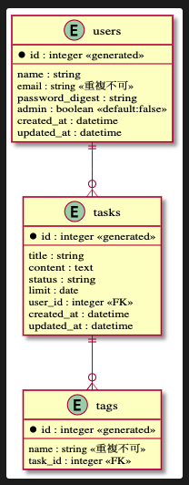

## Herokuへのデプロイに関して
## Version情報
- ruby
  - 2.6.5
- rails
  - 5.2.4.2
- rspec
  - 3.9
- postgresql
  - 12.2
## Herokuへのデプロイ手順
- パス
  - https://whispering-chamber-06924.herokuapp.com
### Herokuへ直接デブロイする方法
1. git push heroku 開発ブランチ名:master
1. heroku run rails db:migrate
### Herokuへの自動デプロイ手順に関して
1. masterにMergeされた時、テスト項目が全てOKなら自動的にデプロイされます。

## ER図
- 保存場所
  - docs/er.puml
- 画像
  - 
## Table設計
- テーブル名
  - 列名
    - 型
- users
  - id
    - integer
  - name
    - string
  - email
    - string
  - password_digest
    - string
  - admin
    - boolean
  - created_at
    - datetime
  - updated_at
    - datetime
- tasks
  - id
    - integer
  - title
    - string
  - content
    - text
  - status
    - string
  - limit
    - date
  - user_id
    - integer
  - created_at
    - datetime
  - updated_at
    - datetime
- tags
  - name
    - string
  - task_id
    - integer
  - created_at
    - datetime
  - updated_at
    - datetime
  
